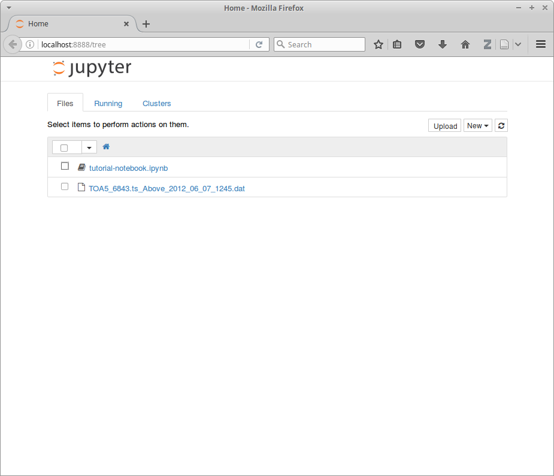

=============
 Installation
=============

.. _Python: https://www.python.org
.. _NumPy: http://www.numpy.org
.. _SciPy: http://www.scipy.org
.. _Matplotlib: http://matplotlib.org
.. _IPython: https://ipython.org
.. _Jupyter: http://jupyter.org
.. _Jupyter documentation: http://jupyter.readthedocs.io/en/latest/index.html
.. _PyWavelets: http://pywavelets.readthedocs.io/en/latest
.. _miniconda: http://conda.pydata.org/docs/install/quick.html
.. _anaconda: https://www.continuum.io/downloads
.. _conda: http://conda.pydata.org/docs

----------------------------------
For experienced Python/SciPy users
----------------------------------

Requirements
~~~~~~~~~~~~

* Python_ >=3.5
* NumPy_
* SciPy_
* Matplotlib_
* PyWavelets_

Recommended
~~~~~~~~~~~

* IPython_
* Jupyter_

Install
~~~~~~~

Recommended:

    Linux, Mac OS X::

        conda install anaconda-client
        conda env create ussl/fluxpart-env
        source activate fluxpart-env

    Windows::

        conda install anaconda-client
        conda env create ussl/fluxpart-env
        activate fluxpart-env

Alternatively:

    ::

        conda install -c ussl fluxpart

    or:

    ::

        pip install fluxpart

-----------------------------
For novice Python/SciPy users
-----------------------------

**Fluxpart** is a Python 3 module. Using it requires a Python_ language
interpreter as well as a few standard scientific Python libraries (SciPy_).

The recommended way to install **fluxpart** and create the required
computational environment is to use conda_, an open source package and
environment management system that works on Linux, Mac OS X, and Windows. Conda
can be obtained by installing miniconda_, a small Python distribution that
includes conda and a Python interpreter (alternatively, conda can be obtained
by installing the larger anaconda_ distribution). Miniconda installs and
operates at the user level, so its installation and use does not require
administrator rights, nor will it affect other OS-level Python installations
already on your machine.  If miniconda (or anaconda) is already installed on
your machine, skip the next paragraph.

Follow the instructions for your operating system on the miniconda_ quick start
page for downloading and installing.  We advise choosing the latest Python 3.x
installer (**not** Python 2.7).

Verify that conda is installed by opening a terminal emulator (command prompt
window) and entering at the command line::

    conda --version

Conda should respond with the version number of the installed package (e.g.,
``conda 4.1.12``). If you have an older, previously installed version of conda,
it is advised to update it  with::

    conda update conda

Next, install ``anaconda-client`` into the root environment::

    conda install anaconda-client

Finally, create a conda environment containing **fluxpart** and its
dependencies, as well as some useful libraries for plotting and analysis
(Matplotlib_, Jupyter_), by entering::

    conda env create ussl/fluxpart-env

To activate the **fluxpart** environment, enter:

    Linux, Mac OS X:::

        source activate fluxpart-env

    Windows::

        activate fluxpart-env

The command line prompt should now be prepended with ``(fluxpart-env)``,
indicating that the **fluxpart** environment is active in the shell session.

If you are new(ish) to Python_, a good tool for learning and interactively
building-up **fluxpart** analyses is the `Jupyter notebook`__. From the command
line, make and cd into a new working directory, e.g.::

    mkdir fluxnb
    cd fluxnb

An example notebook and high-frequency eddy covariance data file can be
downloaded with::

    anaconda download ussl/tutorial-notebook
    anaconda download ussl/tutorial-data

The Jupyter notebook application can be launched from the command line of an
active **fluxpart** shell session::

    jupyter notebook

The Jupyter dashboard will start in a web browser window, and look something
like this:

Clicking on the ``tutorial-notebook.ipynb`` link will open the notebook in a
new browser tab:

.. image:: screenshot_jupyter_notebook.png

The notebook has code from the :ref:`tutorial-quickstart` example. Selecting a
cell in the notebook and hitting <Shift><Enter> executes the code in the cell.
Note that the downloaded data is only the single file used in the
:ref:`tutorial-quickstart` example and not the larger dataset used in latter
part of the :ref:`fluxpart-tutorial`. See the `Jupyter documentation`_ for
complete information about Jupyter notebooks, and :ref:`fluxpart-tutorial` for
getting started with **fluxpart**.

__ Jupyter_

If at some point it is desired to deactivate the **fluxpart**  environment,
then:

    Linux, Mac OS X::

        source deactivate

    Windows::

        deactivate
