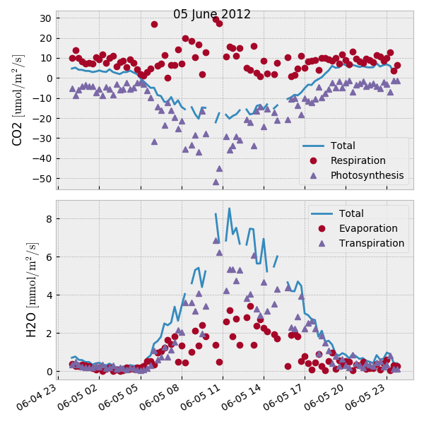
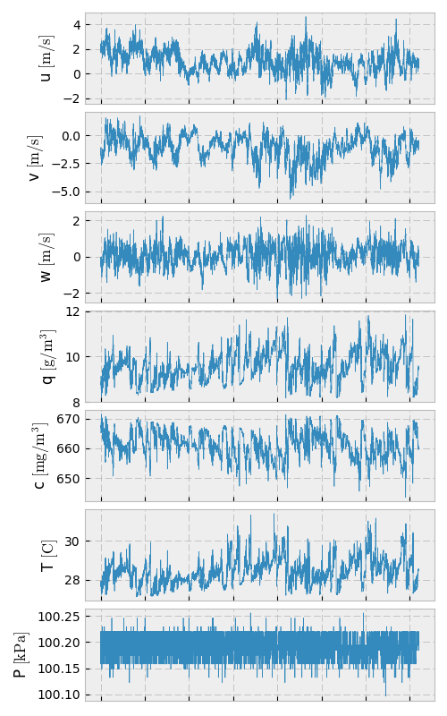
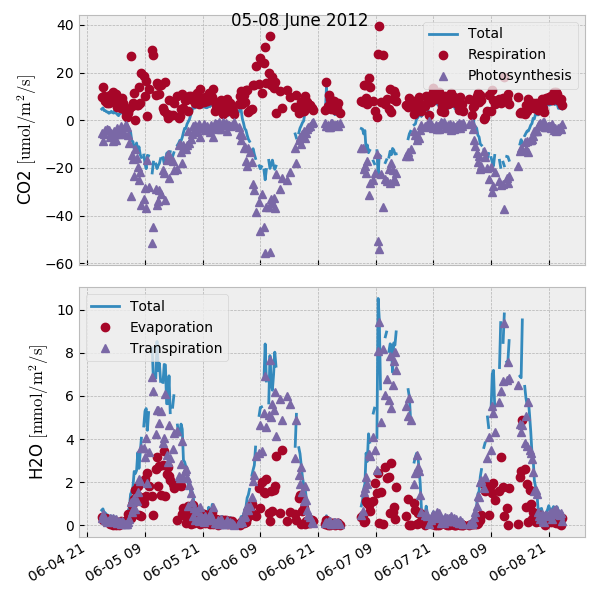

.. _fluxpart-tutorial:

========
Tutorial
========

**Fluxpart** is a Python 3 module that implements the Scanlon and Sahu
[SS08]_ method for partitioning eddy covariance measurements of water vapor and
carbon dioxide fluxes into stomatal (transpiration, photosynthesis) and
nonstomatal (evaporation, respiration) components, e.g.

This tutorial assumes a basic familiarity with the Python_ programming
language, the SciPy_ ecosystem, and the flux partitioning procedure developed
in [SS08]_.  An overview of the flux partitioning algorithm is given
:ref:`here <fluxpart-background>`.  A more complete explanation of the
partitioning method can be found in [SS08]_, [SK10]_, and [PRV14]_.

.. _Python: https://www.python.org
.. _SciPy: https://www.scipy.org

Notation and Definitions
------------------------

The following notation is used in variable naming and documentation to
represent meteorological quantities:

.. code-block:: none

    u, v, w = horizontal (u, v) and veritcal (w) wind velocities
    q = water vapor mass concentration
    c = carbon dioxide mass concentration
    T = air temperature
    P = total air pressure

The partitioning algorithm processes high-frequency eddy covariance data to
determine interval average values for the water vapor and carbon dioxide
fluxes:

.. code-block:: none

    Fq = <w'q'> = Total H2O vapor flux
    Fqe = <w'qe'> = Nonstomatal component of H2O vapor flux (evaporation)
    Fqt = <w'qt'> = Stomatal component of vapor flux (transpiration)
    Fc =  <w'c'> = Total CO2 flux
    Fcr = <w'cr'> = Nonstomatal component of CO2 flux (respiration)
    Fcp = <w'cp'> = Stomatal component of CO2 flux (photosynthesis)

where a prime indicates the fluctuation of a scalar quantity and angle brackets
indicate time averaging over an interval (e.g. 0.25 to 1 h).

The following definitions, relations, and requirements exist:

.. code-block:: none

    Fq = Fqe + Fqt
    Fc = Fcr + Fcp
    Fqe > 0
    Fqt > 0
    Fcr > 0
    Fcp < 0
    WUE = Fcp/Fqt < 0

where `WUE` is leaf-level water use efficiency.

.. _tutorial-quickstart:

Quickstart
----------

The plots show the contents of :file:`TOA5_6843.ts_Above_2012_06_07_1245.dat`,
a delimited text file containing 15 minutes of high-frequency (20 Hz) eddy
covariance data for wind velocity (*u*, *v*, *w*), water vapor (*q*) and carbon
dioxide (*c*) concentrations, air pressure (*P*), and air temperature (*T*):

.. literalinclude:: text/cat_quickstart.txt

Partitioned, time-averaged fluxes for the 15 min data interval are found by:

.. literalinclude:: _tutorial/tutor.py
    :start-after: BEGIN quickstart
    :end-before: END quickstart
    :dedent: 4

.. literalinclude:: text/quickstart_fluxes_out.txt

Partitioning with :func:`~fluxpart.fluxpart.flux_partition`
-----------------------------------------------------------

A complete implementation of the flux partitioning procedure is provided by
the function :func:`~fluxpart.fluxpart.flux_partition`.

The full procedure involves:

-  Reading high-frequency eddy covariance data
-  Performing basic data QA/QC
-  Making necessary data transformations (unit conversions, external effects
   corrections)
-  Estimating WUE if measurements are not available
-  Seeking a physically acceptable partitioning solution, progressively
   removing low frequency components from data as needed to conform with flux
   variance similarity assumptions

:func:`~fluxpart.fluxpart.flux_partition` has several parameters and options
that specify how these procedures are performed.  To get started, we'll
consider the Quickstart_ example in detail.

Quickstart revisited
~~~~~~~~~~~~~~~~~~~~

In the Quickstart_ example, the arguments in the call to
:func:`~fluxpart.fluxpart.flux_partition` such as ``fname`` and
``hfd_optionns`` indicate the format of the high-frequency eddy covariance data
file, as well as various options about the flux partitioning analysis.  Let's
consider these arguments individually.

fname
^^^^^

.. literalinclude:: _tutorial/tutor.py
    :start-after: BEGIN quickstart
    :end-before: END quickstart
    :emphasize-lines: 3

``fname`` is a **required** string variable specifying the name of the high
frequency data file. The file must be a delimited text file, with one data
record per line. If the data file is not in the current working directory,
``fname`` must include path information, such as
``fname='C:/users/todd/mydata.dat'`` on Windows, or
``fname='/home/todd/mydata.dat'`` on Linux or OS X).  In the Quickstart_
example, the data file resided in a "data" subdirectory of the current working
directory, so a relative (rather than absolute) path was given.  

hfd_options
^^^^^^^^^^^

.. literalinclude:: _tutorial/tutor.py
    :start-after: BEGIN quickstart
    :end-before: END quickstart
    :emphasize-lines: 4-9

``hfd_options`` is a dictionary of parameters specifying options for reading,
quality control, and correcting high frequency eddy covariance data.
``hfd_options`` is an `optional` parameter IF (and only if) `fname` conforms to
the default or expected data file format: a white space delimited text file
with no header or footer lines, all data in SI units (m/s, kg/m^3, Pa, K), and
data columns (1, 2, 3, 4, 5, 6, 7) corresponding to (u, v, w, q, c, T, P)
(where columns are numbered using 0-based indexing, i.e. the first column is
referred to as column 0). If these assumptions are not met, or if
non-default QC or data handling is desired, it is required to indicate the file
formatting and data handling options by specifying the appropriate
``hfd_options`` fields:

hfd_options['cols'] \: 7*(int,)
    A 7-tuple of integers indicating the column numbers of `fname` that contain
    series data for (u, v, w, q, c, T, P), in that order. Uses 0-based
    indexing. Default is (1, 2, 3, 4, 5, 6, 7) (and thus the first column in
    the file is not used). In the Quickstart_ example, the data file has 10
    columns. The first two (columns 0 and 1) hold timestamp and record
    information, and the last (column 9) is a flag.  The remaining 7 columns
    are 2=u, 3=v, 4=w, 6=q, 5=c, 7=T, and 8=P, so ``hfd_options['cols']=(2,
    3, 4, 6, 5, 7, 8)``.

hfd_options['unit_convert'] \: dict
    Dictionary of multiplication factors required to convert any u, v, w, q, c,
    or P data not in SI units to SI units (m/s, kg/m^3, Pa). (Note T is not in
    that list). The dictionary keys are the variable names. In the Quickstart_
    example, the q (g/m^3), c (mg/m^3), and P (kPa) data are not in SI units,
    so we set:
    ``hfd_options['unit_convert']={'q': 1e-3, 'c': 1e-6, 'P': 1e3}``, since
    it is necessary to multiply the g/m^3 water vapor data by 1e-3 to obtain
    the SI concentration unit (kg/m^3), the mg/m^3 CO2 data by 1e-6 to
    obtain the SI concentration unit (kg/m^3), and the kPa pressure data by 1e3
    to obtain the SI pressure unit (Pa).

hfd_options['temper_unit'] \: {'K', 'C'}
    A sting indicating the units of the temperature data in `fname`. The
    default is the SI unit, 'K'. Since the temperature data in the Quickstart_
    example were in degrees C, it was necessary to set
    ``hfd_options['temper_unit']='C'``.

Many additional ``hfd_options`` can be set.  ``hfd_options['bounds']`` is a
dictionary for specifying lower and upper bounds for valid data.  Data records
are rejected if a variable in the record is outside the prescribed bounds. By
default, a data record is rejected if either q or c is negative.
``hfd_options['flags']`` can be used to indicate that one or more columns in
`fname` are used to flag bad data records.  ``hfd_options['rd_tol']`` and
``hfd_options['ad_tol']`` are tolerances for rejecting an entire datafile based
the number or fraction of bad data records found.  ``hfd_options['ustar_tol']``
is the tolerance for rejecting a data file based on a too low friction velocity
(insufficient turbulence). The default value is 0.1 m/s.
``hfd_options['correcting_external']`` is a boolean that indicates whether the
water vapor and carbon dioxide series data should be corrected for external
fluctuations associated with air temperature and vapor density according to
[WPL80]_ and [DK07]_ (default is True).  See
:func:`~fluxpart.fluxpart.flux_partition` for details on using any of these
``hfd_options``.

If `hfd_options` contains field names that are not recognized by
``flux_partition``, the unrecognized key:value pairs are passed as keyword
arguments to numpy.genfromtxt_ (where the data file is read).  These additional
keywords are often required to specify the details of the formatting of the
delimited datafile. See numpy.genfromtxt_ for a full listing of available
formatting options. Among the most commonly required are:

hfd_options['delimiter'] \: str, int, or sequence
    The string used to separate values or define column widths. By default
    any consecutive whitespace delimits values. The Quickstart_ example uses
    instead a comma delimited format, ``hfd_options['delimiter']=","``.

hfd_options['skip_header'] \: int
    Integer that specifies the number of lines to skip at the beginning of 
    the data file.  The Quickstart_ datafile has 4 lines of headers before the
    numerical time series data start, so ``hfd_options['skip_header']=4``.
    The default is to not skip any lines.

.. _numpy.genfromtxt:
    http://docs.scipy.org/doc/numpy/reference/generated/numpy.genfromtxt.html

wue_options
^^^^^^^^^^^

.. literalinclude:: _tutorial/tutor.py
    :start-after: BEGIN quickstart
    :end-before: END quickstart
    :emphasize-lines: 10-

``wue_options`` is a dictionary of parameters for specifying options related to
estimating leaf-level water use efficiency (WUE).
If a measured or otherwise known value for leaf-level WUE is available, it can
be passed to :func:`~fluxpart.fluxpart.flux_partition` using the ``meas_wue``
parameter (in units of kg CO2/ kg H2O). In this case, ``wue_options`` is not
required. For example,

.. literalinclude:: _tutorial/tutor.py
    :start-after: BEGIN known_wue
    :end-before: END known_wue
    :emphasize-lines: 10-

If WUE is unknown and must be estimated, it is required that ``wue_options``
be provided with at a minimum the following three field-site metadata entries
given:

wue_options['meas_ht'] \: float
    Eddy covariance measurement height (meters)

wue_options['canopy_ht'] \: float
    Plant canopy height (meters)

wue_options['ppath'] \: {'C3' or 'C4'}
    Photosynthetic pathway of the vegetation at the site

Other (optional) ``wue_options`` are (see
:func:`~fluxpart.wue.water_use_efficiency` for a full description of these
options):

wue_options['ci_mod'] \: str
    A string that indicates the model to be used to calculate the intercellular
    CO2 concentration (defalut is 'const-ratio').
    
wue_options['ci_mod_param'] \: float or 2-tuple of floats
    Specific model parameter values to be used with the model indicated by
    ``wue_options['ci_mod']``.
    
wue_options['leaf_temper'] \: float
    The canopy leaf temperature (K) (set equal to the air temperature if not
    provided).

wue_options['leaf_temper_corr'] \: float
    Adjustment applied to the (measured or estimated) canopy temperature (K)
    before calculating intercellular CO2. The temperature used in the
    intercellular CO2 calculation is `leaf_T` +
    ``wue_options['leaf_temper_corr']``, where `leaf_T` is
    ``wue_options['leaf_temper']`` if provided, and the air temperature
    otherwise. Default is ``wue_options['leaf_temper_corr']=0``.

Additional parameters
^^^^^^^^^^^^^^^^^^^^^

Though not used in the Quickstart_ example,
:func:`~fluxpart.fluxpart.flux_partition` has two additional optional
parameters that can be passed.  The first is ``part_options``, a dictionary for
specifying options related to the partitioning algorithm.  Currently, only one
field is recognized:

part_options['adjusting_fluxes'] \: bool
    If filtering is applied to the series data during the partitioning
    calculations, covariances in the filtered data may differ from those in the
    original data.  Consequently, partitioned flux totals may not match exactly
    the total fluxes indicated by the original data.  If
    part_options['adjusting_fluxes']=True (the default), the final
    partitioned fluxes are adjusted proportionally such that sum of the
    partitioned fluxes match exactly the total fluxes indicated in the original
    data.

The final (optional) :func:`~fluxpart.fluxpart.flux_partition` parameter is:

label \: datetime_
    Optional identification label/object for the data set. Typically it is a
    python datetime_, but it can be a str, int, etc.

.. _datetime:
    https://docs.python.org/3.5/library/datetime.html

Partitioning results
~~~~~~~~~~~~~~~~~~~~

:func:`~fluxpart.fluxpart.flux_partition` returns a dictionary (which was given
the name ``out`` in the Quickstart_ example).  The results dictionary has 7
fields: ``'result'``, ``'fluxes'``, ``'hfsummary'``, ``'wue'``, ``'numersoln'``,
``'qcdata'``, and ``'label'``.

String representations of output
^^^^^^^^^^^^^^^^^^^^^^^^^^^^^^^^

All elements of the **Fluxpart** output have printed string representations
that provide formatting and may use common units for certain attributes, but
the actual object holds all dimensional data in SI units.  As an example, we
can compare the printed and actual ``'fluxes'`` tuple from the Quickstart_
example:

.. literalinclude:: text/quickstart_fluxes_out.txt

.. literalinclude:: text/quickstart_fluxes_rawout.txt

'result'
^^^^^^^^

The ``'result'`` element is a :class:`~fluxpart.containers.Result`
namedtuple that contains information about the overall outcome of the
partitioning:

.. literalinclude:: text/quickstart_result_out.txt

The ``dataread``, ``attempt_partition``,  ``valid_partition`` attributes are
booleans indicating success/failure in reading the high-frequency data and
attempting/obtaining a valid partitioning solution. The string ``mssg`` is a
possibly informative message if any of the booleans are False.

'fluxes'
^^^^^^^^

Already shown above,
the ``'fluxes'`` entry is a :class:`~fluxpart.containers.Fluxes` namedtuple
containing the partitioned fluxes expressed in mass, latent heat, and molar
units.

'hfsummary'
^^^^^^^^^^^

``'hfsummary'`` is a :class:`~fluxpart.containers.HFSummary` namedtuple that
contains a summary of the high-frequency data (various averages, variances,
etc.). ``'hfsummary'`` summarizes the data series being used in the partitioning
analysis, which may not be the entire data file if, e.g., the file contains bad
data.

.. literalinclude:: text/quickstart_hfsummary_out.txt

'wue'
^^^^^

The ``'wue'`` element is a :class:`~fluxpart.containers.WUE` namedtuple
containing a summary of the water use efficiency calculation:

.. literalinclude:: text/quickstart_wue_out.txt

See :class:`~fluxpart.containers.WUE` for an explanation of the various
attributes.

'numersoln'
^^^^^^^^^^^

``'numersoln'`` is a :class:`~fluxpart.containers.NumerSoln` tuple with 
information about the obtained numerical solution:

.. literalinclude:: text/quickstart_numersoln_out.txt

See :class:`~fluxpart.containers.NumerSoln` for an explanation of the
attributes.

'qcdata'
^^^^^^^^

The ``'qcdata'`` entry is a :class:`~fluxpart.containers.QCData` tuple holding
summary information about the eddy covariance data for q and c. Whereas
``'hfsummary'`` contains information about the data in ``fname``, the values in
``'qcdata'`` are for the q and c series data analyzed in the final partitioning
calculation, which may have been filtered to remove low-frequency (large scale)
components.

.. literalinclude:: text/quickstart_qcdata_out.txt

The attribute ``wave_lvl`` is a 2-tuple of integers indicating the level of
filtering that was applied to the data. The second number is the maximum
wavelet decomposition level that could be applied to the data (a value that
depends on the length of the data series). The first is the number of
components *remaining* in the data. So ``wave_lvl = (14, 14)``, for example,
means that the analyzed data had not been filtered (all 14 data components were
present).  ``wave_lvl = (11, 14)`` means that the 3 largest scale components
of the data were removed in the final analysis.

'label'
^^^^^^^

The ``'label'`` results entry is simply whatever was passed to
:func:`~fluxpart.fluxpart.flux_partition` using the **label** parameter.  The
**label** parameter is useful for giving a name or date/time to the data and/or
result (see :ref:`tutorial-example`). The optional **label** parameter was not
specified in the Quickstart_ example, so in this case ``out['label']`` is an
empty string.

.. _tutorial-example:

Processing multiple data files
------------------------------

In this example, the directory ``./data`` contains 4 days of high frequency
eddy covariance data, obtained in a peach orchard, 5-8 June 2012. There are 96
data files per day, each containing 15 min of high-frequency (20 Hz)  data, for
a total of 4 * 96 = 384 data files in the directory.

The naming scheme for the data files is:
``TOA5_6843.ts_Above_2012_06_DD_HHMM.dat``, where the day ``DD`` ranges from 05
to 08, the hour ``HH`` from 00 to 23, and the minute ``MM`` cycles through {00,
15, 30, 45}.

In the following, a short Python script is used to loop over the files in the
archive, apply the :func:`~fluxpart.fluxpart.flux_partition` routine, and save
the results in a list.

The format of every data file is identical and we want to apply the same
analysis to each one, so in our loop the only
:func:`~fluxpart.fluxpart.flux_partition` arguments that change are the data
file name and the label that we will be assigning to each result.  It is
convenient to define a wrapper function that defines all the fixed
:func:`~fluxpart.fluxpart.flux_partition` arguments and has only the two varying
parameters:

.. literalinclude:: _tutorial/tutor.py
    :start-after: BEGIN my_fpart
    :end-before: END my_fpart

The following code uses a nested for loop to iterate over the data files in
chronological order and apply ``my_fpart`` to each one, saving the results in a
list called ``fpout``. The ``label`` for each result is a Python datetime_
object.

.. literalinclude:: _tutorial/tutor.py
    :start-after: BEGIN tutor_example
    :end-before: END tutor_example
    :dedent: 4

**Fluxpart** includes small number of functions for generating quick-and-dirty
matplotlib_ plots of lists of certain
:func:`~fluxpart.fluxpart.flux_partition()` results, e.g.:

.. _matplotlib: http://matplotlib.org/

.. code-block:: python

    from fluxpart.plots import plot_fluxes
    fig = plot_fluxes(fpout, '05-08 June 2012')
    fig.show()

The gaps in the total flux curves occur where a valid solution was not obtained
or where the friction velocity (ustar) was below the specified tolerance (the
default is 0.1 m/s), i.e. at times where there was insufficient turbulence to
apply the eddy covariance method.
