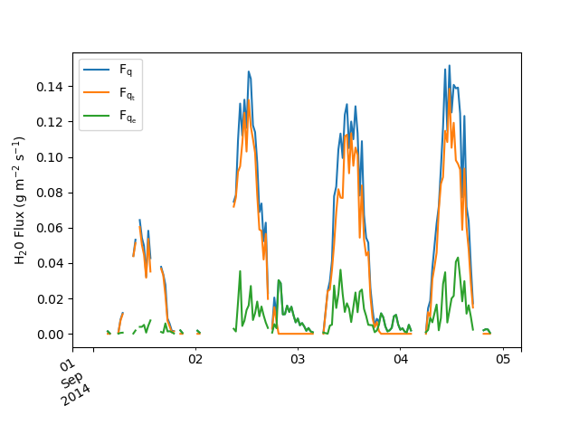

.. _fluxpart-tutorial:

========
Tutorial
========

**Fluxpart** is a Python 3 module that implements the flux variance similarity method [SS08]_ for partitioning eddy covariance measurements of
water vapor and carbon dioxide fluxes into stomatal (transpiration, photosynthesis) and nonstomatal (evaporation, respiration) components.

This tutorial assumes a basic familiarity with the Python_ programming language,
the SciPy_ ecosystem,
and the flux variance similarity partitioning procedure introduced by Scanlon and Sahu [SS08]_.
An overview of the flux partitioning algorithm is given in [SAAS+18]_ and :ref:`here <fluxpart-background>`.
Additional explanation of the partitioning method can be found in [SS08]_, [SK10]_, and [PRV14]_.

.. _Python: https://www.python.org
.. _SciPy: https://www.scipy.org

Notation and Definitions
------------------------

The following notation is used in variable naming and documentation to represent meteorological quantities:

.. code-block:: none

    u, v, w = horizontal (u, v) and veritcal (w) wind velocities
    q = water vapor mass concentration
    c = carbon dioxide mass concentration
    T = air temperature
    P = total air pressure

The partitioning algorithm processes high-frequency eddy covariance data to determine interval average values for the water vapor and carbon dioxide fluxes:

.. code-block:: none

    Fq = <w'q'> = Total H2O vapor flux
    Fqe = <w'qe'> = Nonstomatal component of H2O vapor flux (evaporation)
    Fqt = <w'qt'> = Stomatal component of vapor flux (transpiration)
    Fc = <w'c'> = Total CO2 flux
    Fcr = <w'cr'> = Nonstomatal component of CO2 flux (respiration)
    Fcp = <w'cp'> = Stomatal component of CO2 flux (photosynthesis)

where a prime indicates the fluctuation of a scalar quantity and angle brackets indicate time averaging over an interval (e.g., 30 min).

The following definitions, relations, and requirements exist:

.. code-block:: none

    Fq = Fqe + Fqt
    Fc = Fcr + Fcp
    Fqe > 0
    Fqt > 0
    Fcr > 0
    Fcp < 0
    WUE = Fcp/Fqt < Fc/Fq < 0

where `WUE` is leaf-level water use efficiency.

Partitioning with :func:`~fluxpart.api.fvs_partition`
-----------------------------------------------------

A complete implementation of the flux variance similarity partitioning method is provided by the function :func:`~fluxpart.api.fvs_partition`.

The full procedure involves:

-  Reading high-frequency eddy covariance data
-  Performing basic data QA/QC
-  Making necessary data transformations (unit conversions, external effects corrections)
-  Estimating WUE if measurements are not available
-  Seeking a physically acceptable partitioning solution, progressively removing low frequency components from data as needed to conform with flux variance similarity assumptions

:func:`~fluxpart.api.fvs_partition` has several parameters and options that specify how these procedures are performed.
At a minimum, it is necessary to
(i.) specify the location and format of high frequency data; and
(ii.) provide either a value for the water use efficiency or other data needed to estimate water use efficiency.

Consider the following example.
Suppose high frequency eddy covariance data for several years are stored as delimited text files in a directory :file:`/media/tower`,
each file holding 15 minutes of data with the file naming convention :file:`TOA5_YYYY_MM_DD_HHMM.dat`.

Fluxes partitioned at 30 minute intervals for the dates May 1, 2014 through September 30, 2014 can be found found by:

.. literalinclude:: _tutorial/tutor.py
    :start-after: BEGIN tutorfvsp
    :end-before: END tutorfvsp
    :dedent: 4

Plotting a portion (Sept. 1--4) of the obtained water vapor mass fluxes:

.. literalinclude:: _tutorial/tutor.py
    :start-after: BEGIN tutorplot
    :end-before: END tutorplot
    :dedent: 4

Let's consider individually the different parts of this example. 

High frequency data location
~~~~~~~~~~~~~~~~~~~~~~~~~~~~

The lines highlighted below specify the data location:

.. literalinclude:: _tutorial/tutor.py
    :start-after: BEGIN tutorfvsp
    :end-before: END tutorfvsp
    :emphasize-lines: 3,9

(Note that the file pathnames in this example are Unix-style.
On Windows, the equivalent would be ``data_files = "C:/media/tower/*_2014_0[4-9]_*``, etc.)

file_or_dir
^^^^^^^^^^^

``file_or_dir`` is the pathname for the  high frequency eddy covariance data file, data directory, or a list of either.
Pathnames can be relative or absolute, and can include Unix shell-style wildcards (\*, ?, and character ranges expressed with [ ]).
If ``file_or_dir``,  or one or its elements, is a directory, then all files in that directory are read.
For example:

.. code-block:: python

    file_or_dir="c:/some/path/file1.dat"
    file_or_dir="../some/relpath/file*.tob"
    file_or_dir="c:/some/path/*_201[12]_0[4-9]_*.dat"
    file_or_dir=["c:/some/path/file1.tob", "C:/path/file2.tob"] 
    file_or_dir="/some/path"
    file_or_dir=["../path1/*", "C:/path2/filename_??.dat"]

Related: :ref:`performance-howto`

High frequency data format
~~~~~~~~~~~~~~~~~~~~~~~~~~

The highlighted line indicates the format of the high frequency data:

.. literalinclude:: _tutorial/tutor.py
    :start-after: BEGIN tutorfvsp
    :end-before: END tutorfvsp
    :emphasize-lines: 10

hfd_format
^^^^^^^^^^

Normally, a dictionary of parameters specifying the file format is passed using the ``hfd_format`` argument.
In this example, however, we take advantage of the fact that the file format matches one of the pre-defined data formats.
So instead of a dictionary of format specifications, we simply pass a string indicating the name ("EC-TOA5") of the pre-defined format.
The equivalent dictionary specification for the "EC-TOA5" format is: 

.. code-block:: python

    hfd_format = {
        "filetype": "csv",
        "cols": (2, 3, 4, 5, 6, 7, 8),
        "time_col": 0,
        "unit_convert": dict(q=1e-3, c=1e-6, P=1e3),
        "temper_unit": "C",
        "skiprows": 4,
        "na_values": "NAN"                                                          
    }

When passing a custom ``hfd_format`` dictionary in this manner, it is required at a minimum to provide values for `filetype` and `cols`.
`time_col` is also required if `filetype` is "csv".
`unit_convert` and `temper_unit` are required if data are not in SI units.

The primary ``hfd_format`` keys are:

hfd_format["filetype"] \: {"csv", "tob1", "ghg", "pd.df"}, *required*
    "csv" = delimited text file; "tob1" = Campbell Scientific binary data table format;
    "ghg" = LI-COR raw data format; "pd.df" = pandas dataframe.

hfd_format["cols"] \: 7*(int,), *required*
    7-tuple of integers indicating the data column numbers that contain series data for (u, v, w, c, q, T, P), in that order.
    Uses 0-based indexing.

hfd_format["time_col"] \: int, *required for csv filetype*
    Datafile column containing datetime stamps. Uses 0-based indexing.

hfd_format["unit_convert"] \: dict
    Dictionary of multiplication factors required to convert any u, v, w, c, q, or P data not in SI units to SI units (m/s, kg/m^3, Pa).
    (Note T is not in that list).
    The dictionary keys are the variable names.
    For example, if all data are in SI units except P and c, which are in kPa and mg/m^3, respectively, then set: ``hfd_options["unit_convert"] = {"P": 1e3, "c": 1e-6}``,
    since it is necessary to multiply the kPa pressure data by 1e3 to obtain the SI pressure unit (Pa), and the mg/m^3 CO2 data by 1e-6 to obtain the SI concentration unit (kg/m^3).
    c and q data can be converted this way if they have units of mass or moles per volume.
    If instead the c and q data are given as mole fractions (e.g., mmol of q per mol dry air), then set the c and q converters to one of the following:
    "ppm_dry", "ppt_dry", "ppm_wet", or "ppt_wet".
    Use the "_dry" versions if the mole fraction data are w.r.t. to dry air (no water vapor) and "_wet" if they are w.r.t. moist air.
    For example, if q is in mmol q per mol dry air and c is umol c per mol dry air, then:
    ``{"P": 1e3, "q": "ppt_dry", "c": "ppm_dry"}``.

hfd_format["temper_unit"] \: {"K", "C"}
    Temperature data units. Default is "K" (Kelvin).

When `hfd_format["filetype"]` is "csv", Fluxpart uses pandas.read_csv_ to read files.
Any `hfd_format` key:value pairs not recognized by Fluxpart are passed to pandas.read_csv_;
See pandas.read_csv_ for an explanation of the many available formatting options,
including "sep", which permits reading text files delimited by characters other than ",".
The "EC-TOA5" definition uses two such keywords:

hfd_format["skiprows"] \: int
    Number of header rows to skip at the top of the file.

hfd_format["na_values"] \: 
    String to be recognized as NaN, in addition the default list of NaN strings (see pandas.read_csv_).

A final ``hfd_format`` keyword recognized by Fluxpart, but not used in this example, is the "flags" key:

hfd_format["flags"] \: 2-tuple or list of 2-tuples
    Specifies that one or more data columns are used to flag bad data records.
    Each tuple is of the form (col, goodval),
    where col is an int specifying the column number containing the flag (0-based indexing),
    and goodval is the value of the flag that indicates a good data record.

A second pre-defined format that is currently available uses the Campbell Scientific tob1 file format:

.. code-block:: python

    hfd_format="EC-TOB1"

which is equivalent to:

.. code-block:: python

    hfd_format = {
        "filetype": "tob1",
        "cols": (3, 4, 5, 6, 7, 8, 9),
        "temper_unit": "C",
        "unit_convert": dict(q=1e-3, c=1e-6, P=1e3),
    }

With tob1 files, `time_col` is not used.
The date and time are determined from the named "SECONDS" and "NANOSECONDS" columns.

A third pre-defined format uses the LI-COR raw data format:

.. code-block:: python

    hfd_format="EC-GHG1"

which is equivalent to:

.. code-block:: python

    hfd_format = {
        "filetype": "ghg",
        "sep": "\t",
        "cols": (11, 12, 13, 7, 8, 9, 10),
        "time_col": [5, 6],
        "unit_convert": dict(q=1e-3 * MW.vapor, c=1e-3 * MW.co2, P=1e3),
        "temper_unit": "C",
        "skiprows": 8,
        "na_values": "NAN",
        "to_datetime_kws": {"format": "%Y-%m-%d %H:%M:%S:%f"},
    }

Water Use Efficiency
~~~~~~~~~~~~~~~~~~~~

If the water use efficiency (WUE) is known, it is passed to :func:`~fluxpart.api.fvs_partition` using the ``meas_wue`` argument.
Note that according to the sign convention, WUE must be a negative value.
``meas_wue`` has units of kg CO2 / kg H2O.
``meas_wue`` can be a float value;
the name of a delimited text file that has datetime stamps in the first column and wue values in the second;
or a callable that takes a datetime object as its sole argument and returns a float value.

If WUE is not known, it must be estimated.
The method and data used in the estimation are specified with ``wue_options``.

wue_options
^^^^^^^^^^^

.. literalinclude:: _tutorial/tutor.py
    :start-after: BEGIN tutorfvsp
    :end-before: END tutorfvsp
    :emphasize-lines: 12

``wue_options`` is a dictionary of parameters for specifying options related to estimating leaf-level water use efficiency (WUE)
At a minimum, it is necessary to specify the photosynthetic pathway of the vegetation and the heights of the canopy and the eddy covariance instruments.

wue_options["ppath"] \: {"C3" or "C4"}
    Photosynthetic pathway of the vegetation at the site

The heights can be specified in two ways, either separately as:

wue_options["canopy_ht"] \: float
    Plant canopy height (meters)

wue_options["meas_ht"] \: float
    Eddy covariance measurement height (meters)

or alternatively as:

wue_options['heights'] : str or callable, optional
    If str, is the name of a csv file with date strings in the first column, canopy heights in the second, and measurement heights in the third.
    If callable, accepts a date as its sole argument and returns the tuple of heights, (canopy_ht, meas_ht).

Example file of heights (header row optional):

.. code-block:: none

    date,canopy_height,tower_height
    2012-04-05,4.27,6.61
    2012-04-23,4.27,7.11
    2012-05-07,4.42,7.11
    ...

When data are not given for a particular date, heights from the most recent (previous) available date are used.

Other (optional) ``wue_options`` are (see :func:`~fluxpart.wue.water_use_efficiency` for a full description of these options):

wue_options["ci_mod"] \: str
    A string that indicates the model to be used to calculate the intercellular
    CO2 concentration (default is "const-ratio").
    
wue_options["ci_mod_param"] \: float or 2-tuple of floats
    Specific model parameter values to be used with the model indicated by
    ``wue_options["ci_mod"]``.
    
wue_options["leaf_temper"] \: float
    The canopy leaf temperature (K) (set equal to the air temperature if not
    provided).

wue_options["leaf_temper_corr"] \: float
    Adjustment applied to the (measured or estimated) canopy temperature (K)
    before calculating intercellular CO2. The temperature used in the
    intercellular CO2 calculation is `leaf_T` +
    ``wue_options["leaf_temper_corr"]``, where `leaf_T` is
    ``wue_options["leaf_temper"]`` if provided, and the air temperature
    otherwise. Default is ``wue_options["leaf_temper_corr"]=0``.

Analysis Interval
~~~~~~~~~~~~~~~~~

.. literalinclude:: _tutorial/tutor.py
    :start-after: BEGIN tutorfvsp
    :end-before: END tutorfvsp
    :emphasize-lines: 11

When the time span of the high frequency data files does not match the desired time interval for data aggregation and flux partitioning,
the data analysis interval is set with the ``interval`` argument.
For example, the flux analysis interval is typically 15-60 min, whereas data may be stored in daily files.
The time interval is specified using the pandas string alias_ format (e.g., ``interval="30min"``). 
In the example above, the data were stored in 15 min files, but the analysis was done for 30 min data chunks.
Setting interval to ``None`` treats whole, individual data files as the analysis interval (which is the default).

Partitioning Options
~~~~~~~~~~~~~~~~~~~~

.. literalinclude:: _tutorial/tutor.py
    :start-after: BEGIN tutorfvsp
    :end-before: END tutorfvsp
    :emphasize-lines: 13

The ``part_options`` argument is a dictionary that can be used to set options for the partitioning algorithm.
Currently, two fields are recognized:

part_options["daytime"] \: filename or callable or 2-tuple, optional                    
    When specified, all fluxes for time intervals ending before sunrise or starting after sunset will be assumed non-stomatal.          
    If a filename (str) is passed, the file is a csv file with date stamps in the first column, sunrise times in the second, and sunset in the third.
    If a callable is passed, the function should take a datetime.date object as its sole argument and return a 2-tuple of time objects.
    If a 2-tuple is passed, it is a tuple of python datetime.time objects for (sunrise, sunset).        

Example daytime csv file:

.. code-block:: none

    date,sunrise,sunset
    2014-01-01,07:10,16:54
    2014-01-02,07:10,16:54
    2014-01-03,07:10,16:55
    ...

When data are not given for a particular date, time from the most recent (previous) available date are used.

part_options["adjust_fluxes"] \: bool                                        
    If True (default),
    the final partitioned fluxes are adjusted proportionally such that sum of the partitioned fluxes match exactly the total fluxes indicated in the original data.                

Additional Parameters and Options
~~~~~~~~~~~~~~~~~~~~~~~~~~~~~~~~~

Options for processing high frequency data
^^^^^^^^^^^^^^^^^^^^^^^^^^^^^^^^^^^^^^^^^^

The ``hfd_options`` argument is a dictionary that can be used to set several optional parameters for processing the high frequency data.
Note that several of these are activated by default.

hfd_options["correct_external"] \: bool, optional
    If True (default), the water vapor and carbon dioxide series
    data are corrected for external fluctuations associated with air
    temperature and vapor density according to [WPL80]_ and [DK07]_.

hfd_options["bounds"] \: dict, optional
    Dictionary indicating any lower and upper bounds for valid data.
    Dictionary entries have the form ``varname: (float, float)``,
    where varname is one of "u", "v", "w", "q", "c", "T", or "P",
    and the 2-tuple holds values for the lower and upper bounds:
    ``(lower, upper)``.  Data records are rejected if a variable in
    the record is outside the prescribed bounds. Default is ``bounds
    = {"c": (0, np.inf), "q": (0, np.inf)}`` such that data records
    are rejected if c or q data are not positive values.

hfd_options["rd_tol"] \: float, optional
    Relative tolerance for rejecting the datafile. Default is
    `hfd_options["rd_tol"]` = 0.4. See hfd_options["ad_tol"] for
    further explanation.

hfd_options["ad_tol"] \: int, optional
    Absolute tolerance for rejecting the datafile. Default is
    `ad_tol` = 1024. If the datafile contains bad records (not
    readable, out-of-bounds, or flagged data), the partitioning
    analysis is performed using the longest stretch of consecutive
    good data records found, unless that stretch is too short, in
    which case the analysis is aborted. The criteria for judging
    'too short" can be specified in both relative and absolute
    terms: the datafile is rejected if the good stretch is a
    fraction of the total data that is less than `rd_tol`, and/or is
    less than `ad_tol` records long.

hfd_options["ustar_tol"] \: float
    If the friction velocity (m/s) determined from the high
    frequency data is less than `ustar_tol`, the
    partitioning analysis is aborted due to insufficient turbulence.
    Defalult is `hfd_options["ustar_tol"]` = 0.1 (m/s).

.. _pandas.read_csv:
    https://pandas.pydata.org/pandas-docs/stable/generated/pandas.read_csv.html

.. _alias:
    http://pandas.pydata.org/pandas-docs/stable/timeseries.html#offset-aliases

Analysis and Visualization of Results
-------------------------------------

Perhaps the easiest way to get started working with results is to examine the examples in this Jupyter notebook_.
Additional detail is provided below.

.. _notebook: https://github.com/usda-ars-ussl/fluxpart/blob/master/docs/notebooks/tutorial_example_results.ipynb

:class:`~fluxpart.fluxpart.FluxpartResult`
------------------------------------------

:func:`~fluxpart.api.fvs_partition` returns a :class:`~fluxpart.fluxpart.FluxpartResult` object.
:class:`~fluxpart.fluxpart.FluxpartResult` is the composition of a datetime-indexed pandas_ DataFrame instance with a few convenience methods.

The columns in the DataFrame are multi-indexed. The top level labels are "fluxes", "hfsummary", "wue", "fvsp_solution", and "fluxpart":

FluxpartResult.df.fluxes
    The partitioned flux results.

FluxpartResult.df.hfsummary
    Summary of the high frequency data.

FluxpartResult.df.wue
    Summary of the water use efficiency estimation.

FluxpartResult.df.fvsp_solution
    Computational details about the partitioning solution

FluxpartResult.df.fluxpart
    Meta and summary information about the analysis

The DataFrame can be accessed via  the `df` attribute,
although it is usually not necessary since `__getattr__` and `__getitem__` passed to the DataFrame.
For example,
assuming the :class:`~fluxpart.fluxpart.FluxpartResult` has been named `fvsp` (as was done in the example above),

.. code-block:: python

    fvsp.fluxes

is the same as

.. code-block:: python

    fvsp.df.fluxes

.. _pandas: https://pandas.pydata.org/

Fluxpart results are stored in common units rather than SI units.
For the fluxes,
that means CO2 fluxes are in mg or umol per square meter per second,
and that H2O fluxes are in g or mmol per square meter per second, or in W per square meter.

Because the output from :func:`~fluxpart.api.fvs_partition` exists as a time-indexed pandas_ DataFrame,
any number of data analyses and visualizations are possible.
In addition to the notebook_ mentioned above, see the extensive pandas_ documentation for examples.

Saving and Opening Results
~~~~~~~~~~~~~~~~~~~~~~~~~~

Saving results::

    fvsp.save("my_results.pkl")

Opening saved results::

    from fluxpart import fpread
    fvsp = fpread("my_results.pkl")

Exporting Results
~~~~~~~~~~~~~~~~~

Since the results are stored as a DataFrame,
the whole range of pandas export IO_ options are available.

For example, to export the entire multi-indexed DataFrame

.. code-block:: python

    fvsp.df.to_csv("export_fvsp_file.csv")

To export only the partitioned flux results,

.. code-block:: python

    fvsp.df.fluxes.to_csv("export_fvsp_fluxes.csv")

.. _IO: https://pandas.pydata.org/pandas-docs/stable/io.html
